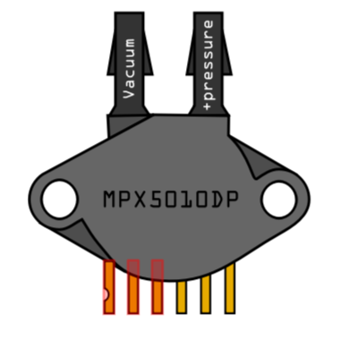

[![CC BY-SA 4.0][cc-by-sa-shield]][cc-by-sa]
# MPX5010DP-Fritzing-part
Fritzing part for the MPX5010DP differential pressure sensor. This is a modification from the MPX4250AP part designed by Andre van Ooijen.

#### Image example (made on Fritzing):

### How to add part:
Open Fritzing then locate the new part under File > Open > MPX5010DP pressure sensor.fzpz The part will then be added to your parts list (under MINE folder) or you can search for it as "# MPX5010DP pressure sensor"

## License & Usage
This work is licensed under a [Creative Commons Attribution-ShareAlike 4.0 International License](http://creativecommons.org/licenses/by-sa/4.0/) **- any use of any material here requires attribution and for derivative content to be shared.**

**Modification created by Dr Kristofer Chan - Department of Geography, King's College London / [remote-research.org](https://remote-research.org) (original part created by Andre van Ooijen).**

[![CC BY-SA 4.0][cc-by-sa-image]][cc-by-sa]

[cc-by-sa]: http://creativecommons.org/licenses/by-sa/4.0/
[cc-by-sa-image]: https://licensebuttons.net/l/by-sa/4.0/88x31.png
[cc-by-sa-shield]: https://img.shields.io/badge/License-CC%20BY--SA%204.0-lightgrey.svg
